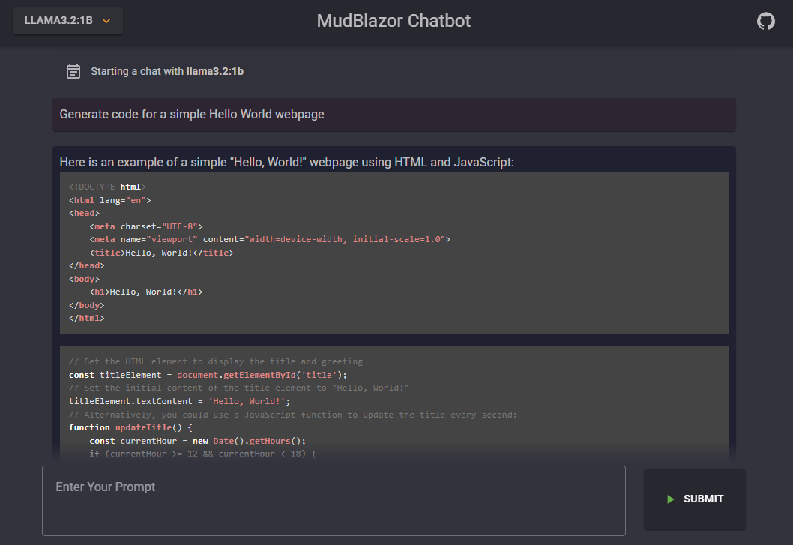
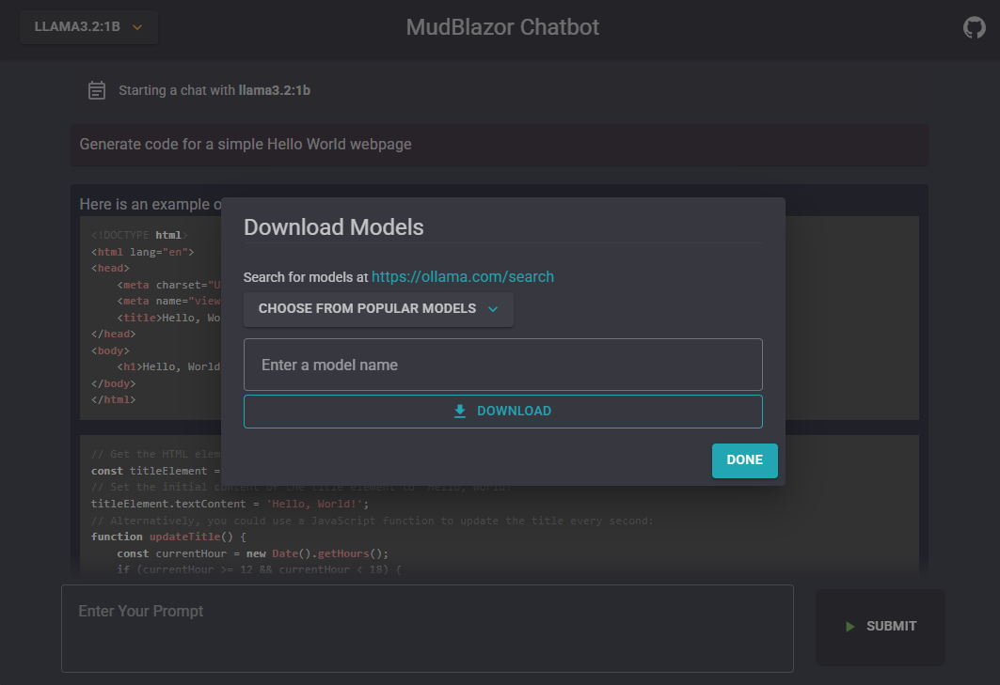
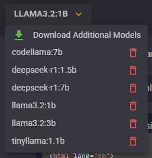

# MudBlazorChatbot
A simple Ollama chatbot client built with Blazor / MudBlazor

## How To Use
Clone the repo to a machine that has Ollama installed. Ensure that Ollama is running. The "OllamaUri" app setting should
be configured to the correct default Ollama port, but change it if necessary. Build and run the chatbot.

### Downloading and Selecting a Model
Use the dropdown in the top left corner to select a model. If no models are available, click the download option to open
a dialog that will allow you to download a model from the Ollama server. A selection of popular models is also available.

### Deleting a Model
To delete a model, click the trash can icon next to the model name in the dropdown. A dialog will open to confirm.

### Using the Chatbot
Once a model has been downloaded and selected, the chatbot is ready to go. Type a message in the prompt box and click
submit. The response will begin to stream to the chat window.

## Roadmap
 - Add feature to save chats and go back to them
 - Add ability to generate and display images
 - Wrap in a docker container along with Ollama
 - Create custom markdown renderer for more control over response formatting
